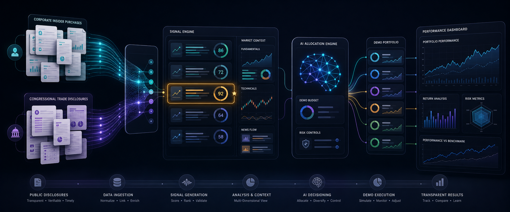
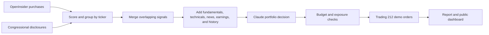

<div align="center">

# 📈 Agent Trading

### A transparent experiment in turning public disclosures into demo portfolio decisions

**Corporate insider purchases and congressional trade disclosures become ranked signals,
market context, AI allocations, demo orders, and an inspectable performance record.**


</div>



<div align="center">

### [🔴 Open the live experiment dashboard](https://thecr7guy2.github.io/agent-trading/)

</div>

---

## 🧭 What Is This?

Agent Trading is an autonomous **demo-account research experiment** built around a
simple question:

> Can public buying disclosures become a repeatable, measurable investment signal when
> they are scored consistently and evaluated with broader market context?

Twice a week, the system looks for recent purchases disclosed by corporate insiders and
members of the US Congress. It ranks those signals, enriches the strongest candidates
with fundamentals, technical indicators, news, earnings, and trading history, then asks
Claude to allocate a capped demo budget.

Orders are sent only to a Trading 212 practice account. Every run is reported and the
portfolio is published to a dashboard so the experiment can be evaluated instead of
remembered selectively.

---

## 🔍 The Two Signal Sources

### 🏢 Corporate insider purchases

[OpenInsider](https://openinsider.com) surfaces SEC Form 4 open-market purchases by
executives, directors, and other company insiders.

The system gives more weight to:

- recent purchases
- larger increases in the buyer's ownership
- C-suite buyers such as a CEO, CFO, COO, president, chair, or CTO
- several insiders buying the same company
- large individual purchases

OpenInsider is an intermediary for SEC-derived data; this project does not scrape SEC
filings directly.

### 🏛️ Congressional trade disclosures

[Capitol Trades](https://www.capitoltrades.com) surfaces public House and Senate trading
disclosures.

The system:

- estimates transaction value from the disclosed range midpoint
- favors more recent transactions
- groups multiple disclosures by ticker
- filters pure congressional candidates above the configured market-cap ceiling
- merges a ticker when both signal sources identify the same company

Congressional reporting can be delayed, so these disclosures are treated as noisy
experimental signals rather than timely privileged information.

---

## 🔄 From Disclosure to Demo Portfolio



### 1. Score conviction

Corporate insider transactions use ownership change, buyer seniority, and recency.
Congressional transactions use estimated disclosed value and recency.

### 2. Add context

Each candidate is enriched with:

- company fundamentals and market capitalization
- 1-month, 6-month, and 1-year price returns
- RSI, MACD, Bollinger Bands, and moving averages
- upcoming earnings information
- recent headlines
- historical insider-buy activity

### 3. Make one portfolio decision

The active pipeline has one AI decision stage. Claude receives the enriched candidate
set, current demo positions, and the budget for the run. It returns ranked buy picks,
allocation percentages, reasoning, optional sell recommendations, confidence, and a
short market summary.

### 4. Apply deterministic controls

Before execution, the system enforces practical limits:

- demo account only
- configurable budget per run
- configurable maximum portfolio investment
- maximum number of picks
- existing-position exposure checks
- a short recently-traded blacklist
- fallback to the next candidate when an order cannot be placed

---

## 📊 What the Dashboard Shows

The [GitHub Pages dashboard](https://thecr7guy2.github.io/agent-trading/) makes the
experiment observable:

- current demo holdings and position-level returns
- invested capital, portfolio value, and unrealized P&L
- portfolio history over time
- comparison with the S&P 100
- recent decision runs and selected stocks
- the model's reasoning and confidence

### Snapshot

The committed dashboard data is automatically refreshed and will change over time. The
snapshot dated **June 12, 2026** contained:

| Signal | Value |
|---|---:|
| Recorded decision runs | **21** |
| Portfolio history points | **70** |
| Open demo positions | **89** |
| Demo capital invested | **€46,220.33** |
| Demo portfolio value | **€48,348.67** |
| Unrealized demo return | **+4.60%** |

This is a point-in-time demo result, not evidence of future returns or a validated
investment strategy.

---

## ⏰ Default Rhythm

All times use `Europe/Berlin` by default and can be changed through environment
variables.

| Time | Days | Activity |
|---|---|---|
| `10:00` | Monday-Friday | Refresh portfolio prices and dashboard |
| `15:30` | Monday-Friday | Refresh portfolio prices and dashboard |
| `17:10` | Tuesday and Friday | Build signals, ask Claude, and place demo orders |
| `17:35` | Tuesday and Friday | Capture end-of-day state, report, and publish dashboard |

---

## 🧩 System Pieces

| Area | Responsibility |
|---|---|
| 🧾 **Market-data tools** | Public disclosures, prices, fundamentals, technicals, earnings, and news |
| 🧠 **Agent pipeline** | Structured Claude decision from the fully enriched digest |
| 🎛️ **Supervisor** | Signal merging, filtering, candidate selection, and cycle control |
| 💶 **Trade executor** | Budget allocation, exposure checks, and order fallback |
| ⏱️ **Scheduler** | Trade cycles, reports, and dashboard refreshes |
| 📣 **Notifications** | Optional Telegram updates |
| 📉 **Reporting** | Markdown reports, terminal summaries, and GitHub Pages data |

```text
agent-trading/
├── src/
│   ├── agents/            Claude decision stage
│   ├── mcp_servers/       market-data and demo-broker tools
│   ├── orchestrator/      signal pipeline, controls, scheduling, and execution
│   ├── notifications/     optional Telegram messages
│   ├── reporting/         reports and dashboard generation
│   └── config.py          environment-driven settings
├── scripts/               scheduler, one-off run, dry run, report, schedule check
├── docs/                  public dashboard and changing data snapshot
└── tests/                 strategy plumbing and integration-contract tests
```

---

## 🚀 Explore It Safely

<details>
<summary><strong>1. Install the environment</strong></summary>

```bash
git clone https://github.com/thecr7guy2/agent-trading.git
cd agent-trading
uv sync
```

</details>

<details>
<summary><strong>2. Configure the demo services</strong></summary>

```bash
cp .env.example .env
```

Required values:

```bash
ANTHROPIC_API_KEY=...
T212_API_KEY=...       # Trading 212 practice-account key
T212_API_SECRET=...
```

News, fundamentals fallback, Telegram, budget, portfolio cap, signal lookbacks, and
schedule settings are optional or have defaults. See [`.env.example`](.env.example).

</details>

<details>
<summary><strong>3. Run without placing orders</strong></summary>

```bash
uv run python scripts/dry_run.py
uv run python scripts/dry_run.py --budget 1500 --lookback 7
```

This runs signal collection, enrichment, and Claude selection but does not submit
broker orders.

</details>

<details>
<summary><strong>4. Inspect or operate the scheduler</strong></summary>

```bash
uv run python scripts/check_schedule.py
uv run python scripts/report.py
uv run python scripts/run_scheduler.py
```

`scripts/run_daily.py` can place demo orders. Read the code and configuration before
using that command.

</details>

---

## 🧪 Why This Is an Experiment

- All inputs are public disclosures and public market data.
- OpenInsider and Capitol Trades are third-party sources whose availability can change.
- Corporate and congressional reports may arrive after the market has reacted.
- Claude output is non-deterministic and can vary between runs.
- The current strategy is primarily buy-oriented; exit logic is less developed.
- A benchmark comparison does not control for risk, timing, concentration, or selection
  bias.
- Demo fills and execution conditions may differ from real-money trading.

## ⚠️ Important Disclaimer

This repository is an educational software experiment, not financial advice or an
invitation to trade. It is configured for a demo account and should not be connected to
real capital without independent review, testing, risk controls, and professional
financial guidance.

---

<div align="center">

### 🔬 Public signals in. Inspectable decisions out.

</div>
